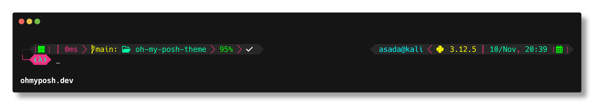

# LambdaRework Theme

**LambdaRework** is a refined adaptation of the original [LambdaGeneration](https://github.com/JanDeDobbeleer/oh-my-posh/blob/main/themes/lambdageneration.omp.json) theme for **Oh My Posh**, featuring enhanced aesthetics and additional information elements.

---

## 📸 Original Theme: LambdaGeneration

---

## 🎨 Customized Theme: LambdaRework

---

## 🐍 Python Virtual Environment Integration
LambdaRework includes a dynamic indicator on the right side of the prompt that displays the **current Python virtual environment (venv) version**.

---

## ⚙️ Installation Guide

If you don’t have **Oh My Posh** installed yet:

1. Download **Oh My Posh** from the official website:  
   👉 [https://ohmyposh.dev/](https://ohmyposh.dev/)

2. Install a **Nerd Font**, required for the icons and symbols to display correctly:  
   👉 [https://www.nerdfonts.com/](https://www.nerdfonts.com/)

---

## 💡 Notes

- Place the `lambdarework.omp.json` file inside your Oh My Posh themes directory.
- Update your PowerShell or terminal configuration file to use the new theme.
- Compatible with Windows, macOS, and Linux terminals.

---

**Based on:** Jan De Dobbeleer’s *LambdaGeneration*  